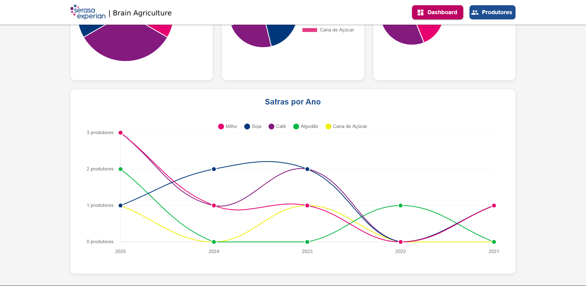

# 🌾 Brain Agriculture

Sistema de gerenciamento de produtores rurais com dashboard analítico e gestão de safras.

<div align="center">


</div>

## 📋 Índice

- [Sobre](#-sobre)
- [Tecnologias](#-tecnologias)
- [Funcionalidades](#-funcionalidades)
- [Arquitetura](#-arquitetura)
- [Instalação](#-instalação)
- [Como Usar](#-como-usar)
- [Testes](#-testes)
- [Design Patterns](#-design-patterns)
- [API Documentation](#-api-documentation)
- [�� Docker](#-docker)

## 🎯 Sobre

Brain Agriculture é um sistema completo para gestão de produtores rurais, permitindo o cadastro de produtores e suas respectivas safras, além de fornecer um dashboard analítico com informações relevantes sobre as fazendas, culturas e uso do solo.

### URLs de Produção

- Frontend: `http://147.79.83.158:3005`
- Backend: `http://147.79.83.158:3006`

## 🚀 Tecnologias

### Frontend
- React 18.x
- TypeScript 4.x
- Material UI 5.x
- Redux Toolkit
- Chart.js
- Axios
- React Router DOM
- Styled Components
- React Toastify
- Jest & Testing Library

### Backend
- NestJS
- TypeScript
- TypeORM
- PostgreSQL
- Class Validator
- Jest
- Swagger

## ✨ Funcionalidades

### Dashboard
- Visualização total de fazendas
- Gráfico de fazendas por estado
- Gráfico de culturas mais plantadas
- Análise de uso do solo
- Gráfico de safras por ano
- Dados totalmente responsivos

### Gestão de Produtores
- CRUD completo de produtores
- Validação de CPF/CNPJ
- Gestão de safras por produtor
- Múltiplas culturas por safra
- Interface responsiva
- Feedback visual com toasts

## 🏗 Arquitetura

### Frontend
```
src/
├── components/      # Componentes reutilizáveis
├── pages/          # Páginas da aplicação
├── services/       # Serviços e API
├── store/          # Redux store e slices
├── types/          # TypeScript interfaces
├── utils/          # Funções utilitárias
└── theme/          # Configuração do tema
```

### Backend
```
src/
├── producers/      # Módulo de produtores
│   ├── controllers/
│   ├── services/
│   ├── entities/
│   └── dto/
├── migrations/     # Migrações do banco
└── config/        # Configurações
```

## 🔧 Instalação

### Pré-requisitos
- Node.js 16+
- PostgreSQL 12+
- NPM ou Yarn

### Frontend
```bash
# Entrar na pasta do frontend
cd frontend

# Instalar dependências
npm install

# Configurar variáveis de ambiente
cp .env.example .env
```

### Backend
```bash
# Entrar na pasta do backend
cd backend-nest

# Instalar dependências
npm install

# Configurar variáveis de ambiente
cp .env.example .env

# Rodar migrações
npm run migration:run
```

## 🎮 Como Usar

### Desenvolvimento

```bash
# Frontend (http://localhost:3000)
cd frontend
npm start

# Backend (http://localhost:3006)
cd backend-nest
npm run start:dev
```

### Produção

```bash
# Frontend
cd frontend
npm run build

# Backend
cd backend-nest
npm run build
npm run start:prod
```

## 🧪 Testes

### Frontend
```bash
# Rodar todos os testes
npm test

# Cobertura
npm run test:coverage

# Modo watch
npm run test:watch
```

### Backend
```bash
# Testes unitários
npm run test

# Testes e2e
npm run test:e2e

# Cobertura
npm run test:cov
```

## 🎨 Design Patterns

- **Repository Pattern**: Abstração do acesso ao banco de dados
- **DTO Pattern**: Validação e transferência de dados
- **Dependency Injection**: Inversão de controle
- **Factory Pattern**: Criação de objetos
- **Observer Pattern**: Gerenciamento de estado com Redux
- **Strategy Pattern**: Validações diferentes para CPF/CNPJ
- **Decorator Pattern**: Validações com class-validator
- **Singleton Pattern**: Conexão com banco de dados

## 📚 API Documentation

## APIs Disponíveis

Base URL: `http://147.79.83.158:3006/produtores/`

### Endpoints

- Dashboard: `http://147.79.83.158:3006/produtores/dashboard`
  - Retorna estatísticas gerais e dados para gráficos

- Produtores: `http://147.79.83.158:3006/produtores`
  - Lista e gerencia informações dos produtores rurais


### Principais Endpoints

```
GET    /produtores           # Lista todos os produtores
POST   /produtores           # Cria novo produtor
GET    /produtores/:id       # Busca produtor por ID
PUT    /produtores/:id       # Atualiza produtor
DELETE /produtores/:id       # Remove produtor
GET    /produtores/dashboard # Dados do dashboard
```

## 🔐 Variáveis de Ambiente

### Frontend (.env)
```env
REACT_APP_API_URL=http://localhost:3006
```

### Backend (.env)
```env
DB_HOST=localhost
DB_PORT=5432
DB_USERNAME=postgres
DB_PASSWORD=your_password
DB_DATABASE=brain_agriculture
```

## 🐳 Docker

### Pré-requisitos
- Docker 20.10+
- Docker Compose 2.0+

### Configuração Inicial

1. Clone o repositório:
```bash
git clone <seu-repositorio>
cd brain-agriculture
```

2. Configure as variáveis de ambiente:
```bash
# Frontend (.env)
REACT_APP_API_URL=http://147.79.83.158:3006

# Backend (.env)
DB_HOST=postgres
DB_PORT=5432
DB_USERNAME=postgres
DB_PASSWORD=Be111290@#
DB_DATABASE=brain_agriculture
```

### Rodando com Docker

1. Construir e iniciar os containers:
```bash
# Construir as imagens
docker-compose build

# Iniciar os serviços
docker-compose up -d
```

2. Verificar os logs:
```bash
# Todos os serviços
docker-compose logs -f

# Serviço específico
docker-compose logs -f backend
docker-compose logs -f frontend
docker-compose logs -f postgres
```

3. Parar os serviços:
```bash
docker-compose down
```

### Gerenciamento do Banco de Dados

1. Acessar o PostgreSQL:
```bash
docker exec -it brain-agriculture-postgres psql -U postgres -d brain_agriculture
```

2. Executar migrações:
```bash
# Dentro do container do backend
docker exec -it brain-agriculture-backend npm run migration:run
```

3. Reverter última migração:
```bash
docker exec -it brain-agriculture-backend npm run migration:revert
```

4. Backup do banco:
```bash
# Criar backup
docker exec brain-agriculture-postgres pg_dump -U postgres brain_agriculture > backup.sql

# Restaurar backup
docker exec -i brain-agriculture-postgres psql -U postgres brain_agriculture < backup.sql
```

### Portas e Acessos

- Frontend: `http://147.79.83.158:3005`
- Backend: `http://147.79.83.158:3006`
- Swagger: `http://147.79.83.158:3006/api`
- PostgreSQL: `5432` (interno)

### Comandos Úteis

1. Reiniciar um serviço:
```bash
docker-compose restart backend
docker-compose restart frontend
docker-compose restart postgres
```

2. Ver logs em tempo real:
```bash
docker-compose logs -f --tail=100
```

3. Verificar status dos containers:
```bash
docker-compose ps
```

4. Limpar volumes (⚠️ apaga dados):
```bash
docker-compose down -v
```

### Troubleshooting

1. Se o frontend não conectar ao backend:
- Verifique se a variável `REACT_APP_API_URL` está correta
- Confirme se o backend está rodando: `docker-compose ps`
- Verifique os logs: `docker-compose logs backend`

2. Se o backend não conectar ao banco:
- Aguarde alguns segundos após subir os containers
- Verifique as credenciais no `.env`
- Confira os logs: `docker-compose logs postgres`

3. Para resetar completamente:
```bash
# Parar todos os containers
docker-compose down

# Remover volumes
docker-compose down -v

# Reconstruir
docker-compose up -d --build
```

---

Feito com ♥ por Nilson Junior


# Screenshots da aplicação 





