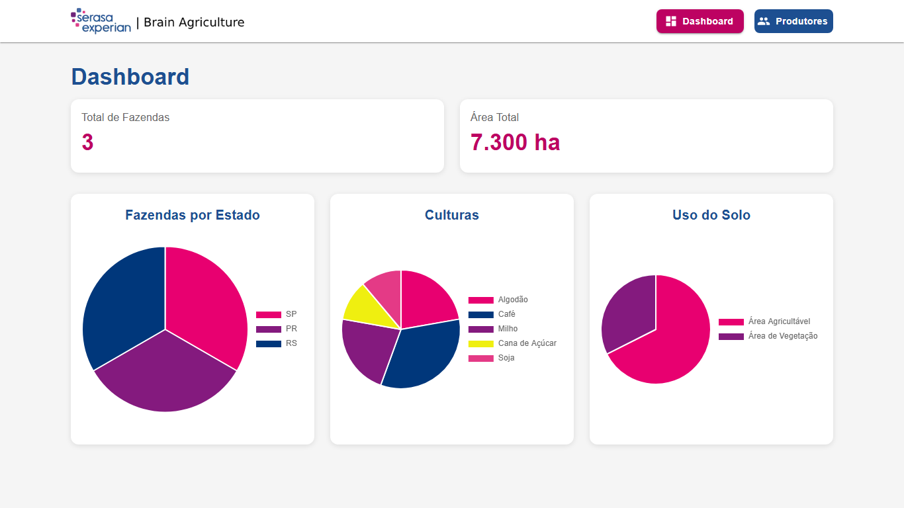
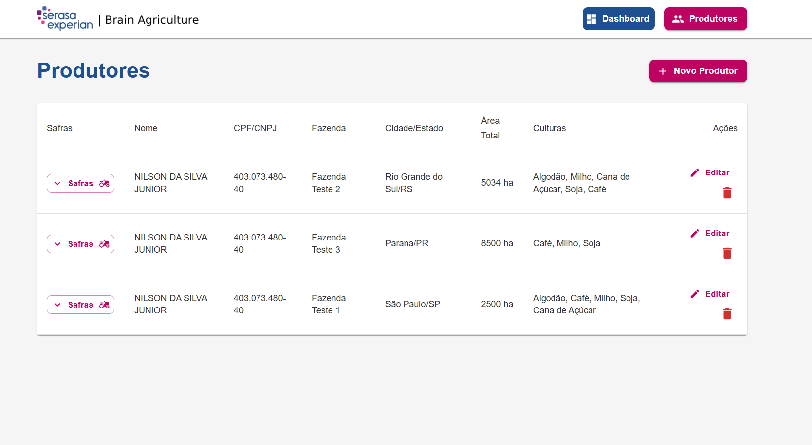
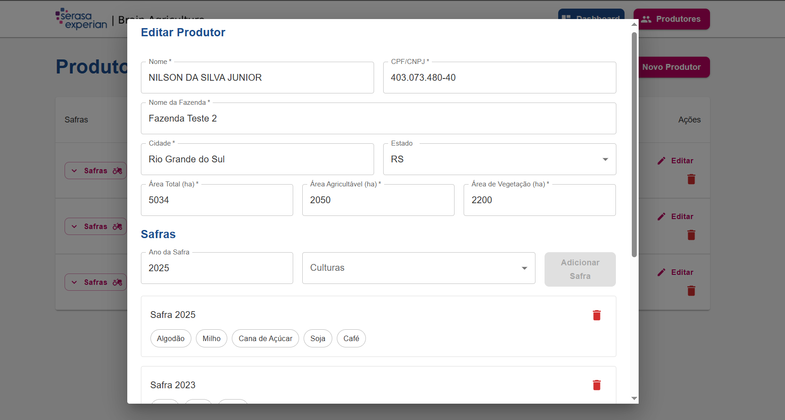

# Brain Agriculture

Sistema de gerenciamento de produtores rurais desenvolvido com React, Node.js e PostgreSQL.

## Requisitos para rodar o sistema

- Node.js 14+
- PostgreSQL 12+
- NPM ou Yarn

O projeto está dividido em duas partes:

- `backend`: API REST desenvolvida com Node.js, Express, TypeORM e PostgreSQL
- `frontend`: Interface web desenvolvida com React, Redux e TypeScript

## Estrutura do Projeto (Monorepo)

O projeto utiliza uma estrutura monorepo, onde frontend e backend estão no mesmo repositório:

```
brain-agriculture/
├── frontend/                # Aplicação React
│   ├── src/
│   ├── public/
│   ├── package.json
│   └── tsconfig.json
│
├── backend/                 # API Node.js
│   ├── src/
│   │   ├── controllers/
│   │   ├── services/
│   │   ├── entities/
│   │   └── migrations/
│   ├── package.json
│   └── tsconfig.json
│
├── package.json            # Scripts compartilhados
├── .gitignore
├── .env.example
└── README.md
```

## Banco de Dados e ORM

### Configuração do Banco
O projeto utiliza PostgreSQL como banco de dados principal, gerenciado pelo TypeORM, um ORM robusto para TypeScript e JavaScript.

### Migrations e Entidades
O TypeORM está configurado com sistema de migrations para versionamento do banco de dados:

1. Gerar uma nova migration:
```bash
npm run typeorm migration:generate
```

2. Executar migrations pendentes:
```bash
npm run typeorm migration:run
```

3. Reverter última migration:
```bash
npm run typeorm migration:revert
```

### Estrutura das Tabelas
O TypeORM gera automaticamente as tabelas baseadas nas entidades TypeScript. Principais entidades:

- **Producer (Produtor)**
  - id: number (PK)
  - name: string
  - document: string (CPF/CNPJ)
  - farmName: string
  - city: string
  - state: string
  - totalArea: number
  - arableArea: number
  - vegetationArea: number
  - crops: string[]

### Validações no Banco
- Validações automáticas via TypeORM e Class Validator
- Constraints de chave primária e foreign key
- Validações de tipos de dados
- Checks para áreas (não podem ser negativas)
- Validações de documento (CPF/CNPJ)

### Conexão com o Banco
A conexão é gerenciada pelo TypeORM através do arquivo `data-source.ts`:
```typescript
{
  type: "postgres",
  host: process.env.DB_HOST,
  port: Number(process.env.DB_PORT),
  username: process.env.DB_USERNAME,
  password: process.env.DB_PASSWORD,
  database: process.env.DB_DATABASE,
  synchronize: false, //Atenção aqui: *Desativado em produção
  logging: true,
  entities: [...],
  migrations: [...],
}
```

## Configuração e Instalação

### Backend

1. Entre na pasta do backend:
```bash
cd backend
```

2. Instale as dependências:
```bash
npm install
```

3. Configure as variáveis de ambiente no arquivo `.env`:
```
DB_HOST=localhost
DB_PORT=5432
DB_USERNAME=postgres
DB_PASSWORD=postgres
DB_DATABASE=brain_agriculture
```

4. Inicie o servidor:
```bash
npm run dev # Atenção aqui: executar run dev para iniciar o server corretamente
```
O servidor estará rodando na porta `3006`

### Frontend

1. Entre na pasta do frontend:
```bash
cd frontend
```

2. Instale as dependências:
```bash
npm install
```

3. Inicie a aplicação:
```bash
npm start # Atenção aqui: Iniciar a aplicação somente após iniciar o backend para não dar conflito de porta
```

A aplicação estará rodando na porta `3005`, ou na porta disponível

## Funcionalidades

- Cadastro, edição e exclusão de produtores rurais
- Validação de CPF e CNPJ com formatação automática
- Validação de áreas da fazenda
- Dashboard com:
  - Total de fazendas
  - Total de área em hectares
  - Gráfico de distribuição por estado
  - Gráfico de distribuição por cultura
  - Gráfico de uso do solo
- Interface responsiva (Desktop e Mobile)
- Feedback visual com toasts para ações do usuário

## Tecnologias Utilizadas

### Backend
- Node.js com TypeScript
- Express para API REST
- TypeORM para ORM
- PostgreSQL como banco de dados
- Class Validator para validação de dados
- Cors para segurança
- Dotenv para variáveis de ambiente
- Sistema de Migrations
- Reflect Metadata

## Docker

O projeto utiliza Docker para containerização com três serviços principais:
- Frontend (brain-agriculture-frontend): Porta 3005
- Backend (brain-agriculture-backend): Porta 3006
- PostgreSQL (brain-agriculture-postgres): Porta 5432

## APIs Disponíveis

Base URL: `http://147.79.83.158:3006`

### Endpoints

- Dashboard: `http://147.79.83.158:3006/dashboard`
  - Retorna estatísticas gerais e dados para gráficos

- Produtores: `http://147.79.83.158:3006/produtores`
  - Lista e gerencia informações dos produtores rurais

### URLs de Produção

- Frontend: `http://147.79.83.158:3005`
- Backend: `http://147.79.83.158:3006`

### Frontend
- React 
- TypeScript
- Material-UI (MUI) para componentes
- Redux Toolkit para gerenciamento de estado
- Styled Components para estilização
- Chart.js para gráficos
- Axios para requisições HTTP
- React Router DOM para roteamento
- React Toastify para notificações
- Jest e Testing Library para testes

## Boas Práticas Implementadas

### Arquitetura e Design
- Clean Code
- SOLID Principles
- Arquitetura em camadas (Controllers, Services, Entities)
- Design Patterns (Repository Pattern)
- Componentização React
- Tipagem forte com TypeScript

### Qualidade de Código
- Validações no frontend e backend
- Tratamento de erros centralizado
- Logging de operações
- Testes unitários
- Code Splitting
- Lazy Loading

### Segurança
- Validação de dados
- Sanitização de inputs
- CORS configurado
- Tratamento de erros sem exposição de dados sensíveis

### UX/UI
- Design responsivo
- Feedback visual para ações
- Formulários com validação em tempo real
- Interface moderna e intuitiva
- Temas customizados
- Loading states
- Tratamento de erros amigável

### DevOps
- Scripts NPM automatizados
- Sistema de migrations
- Ambiente de desenvolvimento configurado
- Variáveis de ambiente

### Controle de Versão e Git

#### Estrutura de Branches
- `main`: Branch principal, código em produção
- `develop`: Branch de desenvolvimento
- `feature/*`: Branches para novas funcionalidades
- `hotfix/*`: Branches para correções urgentes
- `release/*`: Branches para preparação de releases

#### .gitignore na raiz do projeto

#### Workflow Recomendado
1. Crie uma branch para sua feature:
```bash
git checkout -b feature/nome-da-feature
```

2. Faça commits frequentes e descritivos:
```bash
git add .
git commit -m "feat(escopo): descrição clara da mudança"
```

3. Mantenha sua branch atualizada:
```bash
git pull origin develop
```

4. Ao finalizar, faça o merge request/pull request para develop

Feito com dedicação e paixão por tecnologia e programação!

Atenciosamente,
Nilson Junior
Senior Fullstack Developer


# Screenshots da aplicação 








